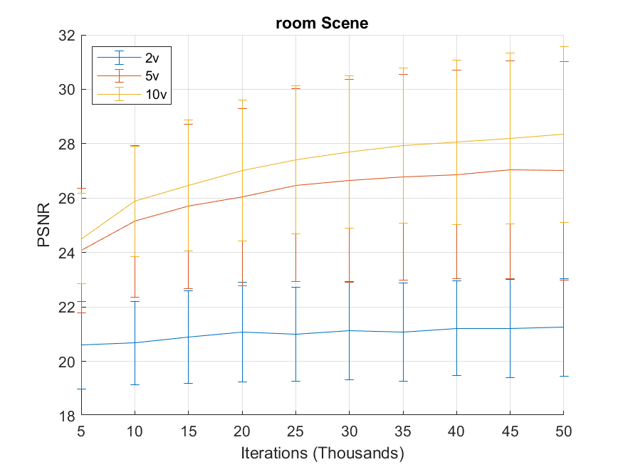
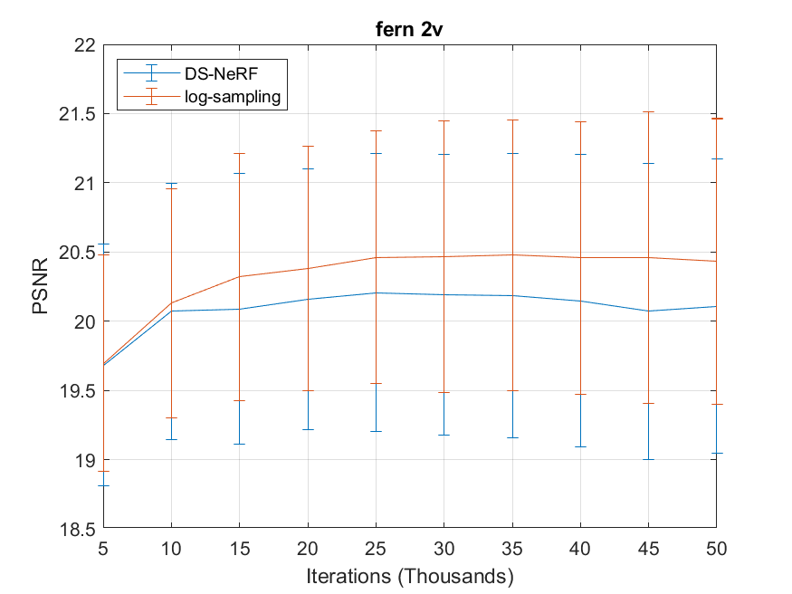

# Depth-supervised NeRF: Fewer Views and Faster Training for Free
## Reproduction and Algorithmic Extension

[ Wai-Ting Li](waitingl@umich.edu)
[Daniel Simmons](dansim@umich.edu)

University of Michigan DeepRob Final Project
Submitted 4/24/2023

---

We propose DS-NeRF (Depth-supervised Neural Radiance Fields), a model for learning neural radiance fields that takes advantage of depth supervised by 3D point clouds. Current NeRF methods require many images with known camera parameters -- typically produced by running structure-from-motion (SFM) to estimate poses and a sparse 3D point cloud. Most, if not all, NeRF pipelines make use of the former but ignore the latter. Our key insight is that such sparse 3D input can be used as an additional free signal during training.

We have recreated the results from the DS-NeRF paper and extendended its scope by implementing non-linear ray sampling. Instead of linear, samples with be sampled in greater proximity around the foreground of the image. This wastes less computation on less significant portions of the training images.

## Results

DS-NeRF training upon the LLFF dataset:
<p align="center">
  
</p>

Non-linear ray sampling slightly improves results:
<p align="center">
  
</p>

---


## Quick Start

### Dependencies

Install requirements:
```
pip install -r requirements.txt
```

You will also need [COLMAP](https://github.com/colmap/colmap) installed to compute poses if you want to run on your data.

### Data

This project was done using the [LLFF dataset](https://drive.google.com/file/d/1RjhfcbsywOvw0ts1AFSri91mKANvEVOa/view?usp=sharing).

### How to Run?

#### Generate camera poses and sparse depth information using COLMAP (optional)

This step is necessary only when you want to run on your data.

First, place your scene directory somewhere. See the following directory structure for an example:
```
├── data
│   ├── fern_2v
│   ├── ├── images
│   ├── ├── ├── image001.png
│   ├── ├── ├── image002.png
```

To generate the poses and sparse point cloud:
```
python imgs2poses.py <your_scenedir>
```

Note: if you use this data format, make sure your `dataset_type` in the config file is set as `llff`.


#### Testing

Once you have the experiment directory (downloaded or trained on your own) in `./logs`, 

- to render a video:
```
python run_nerf.py --config configs/fern_dsnerf.txt --render_only
```

The video would be stored in the experiment directory.

<!-- - to only compute the evaluation metrics:
```
python run_nerf.py --config configs/fern_dsnerf.txt --eval
``` -->


#### Training

To train a DS-NeRF on the example `fern` dataset:
```
python run_nerf.py --config configs/fern_dsnerf.txt
```

It will create an experiment directory in `./logs`, and store the checkpoints and rendering examples there.

You can create your own experiment configuration to try other datasets.

---

## Citation

This repository was based upon the [DS-NeRF](https://github.com/dunbar12138/DSNeRF) repository and modified with concepts from [DONeRF](https://github.com/facebookresearch/DONERF). Please see them for more information.
```
@InProceedings{kangle2021dsnerf,
    author    = {Deng, Kangle and Liu, Andrew and Zhu, Jun-Yan and Ramanan, Deva},
    title     = {Depth-supervised {NeRF}: Fewer Views and Faster Training for Free},
    booktitle = {Proceedings of the IEEE/CVF Conference on Computer Vision and Pattern Recognition (CVPR)},
    month     = {June},
    year      = {2022}
}

@article{neff2021donerf,
author = {Neff, T. and Stadlbauer, P. and Parger, M. and Kurz, A. and Mueller, J. H. and Chaitanya, C. R. A. and Kaplanyan, A. and Steinberger, M.},
title = {DONeRF: Towards Real-Time Rendering of Compact Neural Radiance Fields using Depth Oracle Networks},
journal = {Computer Graphics Forum},
volume = {40},
number = {4},
pages = {45-59},
keywords = {CCS Concepts, • Computing methodologies → Rendering},
doi = {https://doi.org/10.1111/cgf.14340},
url = {https://onlinelibrary.wiley.com/doi/abs/10.1111/cgf.14340},
eprint = {https://onlinelibrary.wiley.com/doi/pdf/10.1111/cgf.14340},
abstract = {Abstract The recent research explosion around implicit neural representations, such as NeRF, shows that there is immense potential for implicitly storing high-quality scene and lighting information in compact neural networks. However, one major limitation preventing the use of NeRF in real-time rendering applications is the prohibitive computational cost of excessive network evaluations along each view ray, requiring dozens of petaFLOPS. In this work, we bring compact neural representations closer to practical rendering of synthetic content in real-time applications, such as games and virtual reality. We show that the number of samples required for each view ray can be significantly reduced when samples are placed around surfaces in the scene without compromising image quality. To this end, we propose a depth oracle network that predicts ray sample locations for each view ray with a single network evaluation. We show that using a classification network around logarithmically discretized and spherically warped depth values is essential to encode surface locations rather than directly estimating depth. The combination of these techniques leads to DONeRF, our compact dual network design with a depth oracle network as its first step and a locally sampled shading network for ray accumulation. With DONeRF, we reduce the inference costs by up to 48× compared to NeRF when conditioning on available ground truth depth information. Compared to concurrent acceleration methods for raymarching-based neural representations, DONeRF does not require additional memory for explicit caching or acceleration structures, and can render interactively (20 frames per second) on a single GPU.},
year = {2021}
}
```